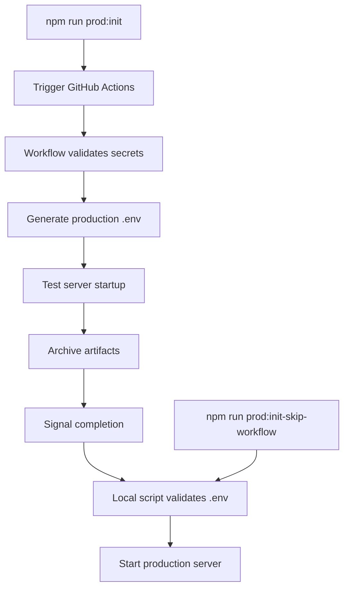

# 🚀 ProspectPro Production Server Initialization Guide

## Overview

The ProspectPro production server now has automated workflow triggering that generates the production `.env` file when initializing the server. This eliminates Railway references and focuses on your existing `generate-dotenv.yml` workflow.

## 🔧 Updated System Architecture

### 1. GitHub Actions Workflow (`generate-dotenv.yml`)

**Updated triggers:**

- ✅ Push to main branch
- ✅ Manual workflow dispatch
- ✅ **NEW:** Repository dispatch events (`server-init`, `prod-server-start`)
- ✅ Deployment events

**Key improvements:**

- Removed Railway deployment references
- Added server initialization signals
- Enhanced environment validation
- Added server readiness confirmation

### 2. Production Server Initialization Script

**File:** `scripts/init-prod-server.sh`

**Features:**

- 🔔 Triggers GitHub Actions workflow via API
- ⏳ Waits for `.env` file generation (5-minute timeout)
- 🔍 Validates environment configuration
- 🚀 Starts production server automatically

### 3. Environment Readiness Checker

**File:** `scripts/check-env-readiness.js`

**Validates:**

- ✅ `.env` file exists with real values (not templates)
- ✅ Required environment variables present
- ✅ GitHub Actions workflow triggerable
- ✅ Server components loadable

## 🎯 Usage Commands

### Option 1: Full Automatic Initialization (Recommended)

```bash
npm run prod:init
```

**What it does:**

1. Triggers GitHub Actions workflow
2. Waits for `.env` generation
3. Validates environment
4. Starts production server

### Option 2: Skip Workflow (Use Existing .env)

```bash
npm run prod:init-skip-workflow
```

**When to use:** When you already have a valid `.env` file

### Option 3: Check Readiness Only

```bash
npm run prod:check
```

**What it does:** Validates environment without starting server

### Option 4: Direct Server Start

```bash
npm run prod
```

**When to use:** When `.env` is already configured and validated

## 🔑 Prerequisites

### Required GitHub Repository Secrets

Configure in `Repository Settings → Secrets and variables → Actions`:

- `SUPABASE_URL`: Your Supabase project URL
- `SUPABASE_SECRET_KEY`: Your Supabase service role key

### Required Environment Variables (for workflow triggering)

```bash
export GHP_SECRET="your_github_personal_access_token"
# OR (fallback)
export GITHUB_TOKEN="your_github_personal_access_token"
```

### Optional Environment Variables

```bash
export GITHUB_REPOSITORY_OWNER="Alextorelli"  # Defaults to Alextorelli
export GITHUB_REPOSITORY_NAME="ProspectPro"   # Defaults to ProspectPro
```

## 🔄 Workflow Process Flow



## 📋 Troubleshooting

### Issue: "No GitHub token found"

**Solution:** Set `GHP_SECRET` environment variable or ensure repository secret is configured

```bash
export GHP_SECRET="ghp_your_token_here"
npm run prod:init
```

### Issue: ".env file contains template values"

**Solution:** Either:

1. Trigger workflow: `npm run prod:init`
2. Manually update `.env` with real values

### Issue: "Workflow trigger failed"

**Possible causes:**

- Invalid GitHub token
- Repository permissions
- Network connectivity

**Solution:** Check token permissions and try again

### Issue: "Environment generation timed out"

**Solution:**

1. Check GitHub Actions tab in repository
2. Verify repository secrets are configured
3. Manual fallback: Copy `.env.example` to `.env` and update values

## 🎯 Production Server Status

After successful initialization, your server will show:

```
🚀 ProspectPro server listening on port 3000 (host: 0.0.0.0)
📊 Health: http://localhost:3000/health
🔧 Boot Report: http://localhost:3000/boot-report
🛠️ Diagnostics: http://localhost:3000/diag
```

### Health Check Endpoints

- `/health` - Basic health status
- `/ready` - Full readiness including database
- `/diag` - Comprehensive diagnostics (sanitized)

## ⚡ Quick Start

1. **Set GitHub token:**

   ```bash
   export GHP_SECRET="your_token"
   ```

2. **Initialize production server:**

   ```bash
   npm run prod:init
   ```

3. **Verify server is running:**

   ```bash
   curl http://localhost:3000/health
   ```

4. **Run a production campaign:**
   ```bash
   curl -X POST http://localhost:3000/api/business-discovery \
     -H "Content-Type: application/json" \
     -d '{"businessType": "electrician", "location": "San Diego, CA", "maxResults": 2, "budgetLimit": 5.00}'
   ```

## 🔒 Security Notes

- ✅ No secrets stored in repository
- ✅ All sensitive data via GitHub Secrets + Supabase Vault
- ✅ Environment validation before server start
- ✅ Graceful degradation if API keys missing
- ✅ Sanitized diagnostic outputs

## 📊 Monitoring

The server includes comprehensive monitoring:

- **Prometheus metrics:** `/metrics`
- **Performance logging:** Enabled in production
- **Cost tracking:** All API calls tracked
- **Circuit breaker:** Prevents cascade failures
- **Graceful shutdown:** Handles termination signals

---

**Your ProspectPro production server is now ready for automated initialization and campaign execution!** 🚀
