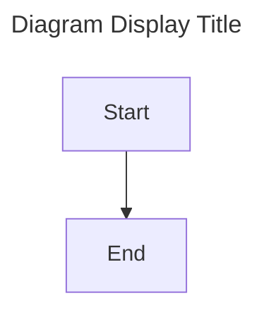

# Mermaid Diagram Suite - ProspectPro

Centralized configuration, scripts, and standards for all Mermaid diagrams in ProspectPro.

## 📁 Directory Structure

```
docs/mmd-shared/
├── config/
│   ├── index.md                    # Config and navigation hub
│   ├── navigation-index.md         # Diagram navigation map
│   ├── mermaid.config.json         # Mermaid theme and layout config
│   ├── icon-registry.json          # Semantic emoji/icon mapping
│   └── puppeteer.config.json       # Browser automation config
├── guidelines/
│   ├── enhanced-diagram-standards.md  # Diagram authoring standards
│   ├── diagram-guidelines.md          # Additional guidelines
│   └── DOCUMENTATION_STANDARDS.md     # Documentation standards
├── scripts/
│   ├── check-tags.mjs              # Validate YAML frontmatter
│   ├── fix-all-diagrams.py         # Clean duplicate tags/headers
│   ├── add-yaml-frontmatter.py     # Add missing YAML frontmatter
│   ├── consolidate-diagrams.sh     # Consolidate legacy diagrams
│   ├── generate-index.py           # Auto-generate diagram index
│   ├── scaffold-diagrams.sh        # Generate new diagram files
│   ├── generate-diagrams.mjs       # Differential rendering engine
│   └── validate-mermaid-diagrams.sh # Full validation suite
└── README.md                       # This file

docs/shared/mermaid/
├── MIGRATION_SUMMARY.md            # Migration technical details
├── CONSOLIDATION_REPORT.md         # Consolidation completion report
└── MAINTENANCE_CHECKLIST.md        # Ongoing maintenance guide
```

## 🚀 Quick Start

### Validate All Diagrams

```bash
npm run docs:validate
```

This checks all `.mmd` files for required YAML frontmatter fields and runs linting.

### Fix Diagram Formatting

```bash
npm run docs:fix
```

Removes duplicate tags, legacy `%%` headers, and adds missing YAML frontmatter.

### Create New Diagrams

```bash
bash docs/mmd-shared/scripts/scaffold-diagrams.sh
```

Generates diagram files from the MECE index with proper YAML frontmatter.

## 📝 Diagram Format Standard

All diagrams **must** use YAML frontmatter:



### Required YAML Fields

- `accTitle`: Accessibility title (short, descriptive)
- `accDescr`: Accessibility description (detailed context)
- `domain`: Taxonomy domain (`app-source`, `dev-tools`, or `integration`)
- `type`: Mermaid diagram type (e.g., `flowchart`, `erDiagram`, `sequenceDiagram`)
- `title`: Human-readable title for navigation
- `index`: Relative path to config index

### Legacy Format (Deprecated)

```mermaid
%% accTitle: Title %%
%% domain: app-source %%
```

**Do not use.** Run `npm run docs:fix` to convert legacy diagrams.

## 🛠️ Scripts Reference

### Validation

| Script                         | Command                                                     | Purpose                   |
| ------------------------------ | ----------------------------------------------------------- | ------------------------- |
| `check-tags.mjs`               | `node docs/mmd-shared/scripts/check-tags.mjs`               | Validate YAML frontmatter |
| `validate-mermaid-diagrams.sh` | `bash docs/mmd-shared/scripts/validate-mermaid-diagrams.sh` | Full validation suite     |

### Maintenance

| Script                    | Command                                                   | Purpose                       |
| ------------------------- | --------------------------------------------------------- | ----------------------------- |
| `fix-all-diagrams.py`     | `python3 docs/mmd-shared/scripts/fix-all-diagrams.py`     | Remove duplicate tags/headers |
| `add-yaml-frontmatter.py` | `python3 docs/mmd-shared/scripts/add-yaml-frontmatter.py` | Add missing YAML frontmatter  |
| `scaffold-diagrams.sh`    | `bash docs/mmd-shared/scripts/scaffold-diagrams.sh`       | Generate new diagram files    |

### Rendering

| Script                  | Command                                              | Purpose                        |
| ----------------------- | ---------------------------------------------------- | ------------------------------ |
| `generate-diagrams.mjs` | `node docs/mmd-shared/scripts/generate-diagrams.mjs` | Differential diagram rendering |

## 🎨 Theme & Configuration

### Mermaid Config

**File:** `config/mermaid.config.json`

Features:

- **Dark grayscale theme** optimized for readability
- **ELK layout engine** for deterministic, hierarchical layouts
- **Accessible color palette** (WCAG 2.1 compliant)
- **Custom fonts** (Inter, Segoe UI)

### Icon Registry

**File:** `config/icon-registry.json`

Semantic emoji mapping for diagram nodes:

```json
{
  "user": "👤",
  "database": "🗄️",
  "api": "🔌",
  "security": "🔒"
}
```

## 📚 Guidelines

### Enhanced Diagram Standards

**File:** `guidelines/enhanced-diagram-standards.md`

Covers:

- YAML frontmatter requirements
- Node naming conventions
- Color and styling patterns
- Accessibility best practices
- Cross-linking between diagrams

### Syntax Guide

**File:** `guidelines/mermaid-syntax-guide.md`

Quick reference for common Mermaid syntax patterns.

## 🔗 Navigation

All diagrams link back to the **config index**:

```markdown
index: ../../../../mmd-shared/config/index.md
```

The config index provides:

- Theme and config documentation
- Icon registry reference
- Diagram authoring guidelines
- Cross-domain navigation map

## 🧪 Testing

### Test a Single Diagram

```bash
npx mermaid-cli -i docs/app/diagrams/my-diagram.mmd -o /tmp/test.svg
```

### Validate Syntax

Use VS Code's Mermaid extension or:

```bash
npm run docs:validate
```

## 🚨 Troubleshooting

### "Parse error on line 1"

**Cause:** Legacy `%%` tags or duplicate YAML frontmatter.

**Fix:**

```bash
npm run docs:fix
```

### "Missing YAML frontmatter"

**Cause:** Diagram missing required metadata.

**Fix:**

```bash
python3 docs/mmd-shared/scripts/add-yaml-frontmatter.py
```

### "Duplicate diagram type declaration"

**Cause:** `flowchart TD` appears twice in the file.

**Fix:**

```bash
python3 docs/mmd-shared/scripts/fix-all-diagrams.py
```

## 📦 NPM Scripts

| Script                  | Description                |
| ----------------------- | -------------------------- |
| `npm run docs:validate` | Validate all diagrams      |
| `npm run docs:fix`      | Fix formatting issues      |
| `npm run docs:prepare`  | Prepare diagrams for build |
| `npm run docs:generate` | Render diagrams            |
| `npm run docs:sync`     | Sync diagram index         |

## 🔄 Workflow

### Adding a New Diagram

1. **Scaffold:**

   ```bash
   bash docs/mmd-shared/scripts/scaffold-diagrams.sh
   ```

2. **Author:**
   Edit the `.mmd` file with your diagram content.

3. **Validate:**

   ```bash
   npm run docs:validate
   ```

4. **Preview:**
   Use VS Code's Mermaid extension or:
   ```bash
   npm run docs:preview
   ```

### Fixing Existing Diagrams

1. **Identify issues:**

   ```bash
   npm run docs:validate
   ```

2. **Auto-fix:**

   ```bash
   npm run docs:fix
   ```

3. **Verify:**
   ```bash
   npm run docs:validate
   ```

## � Further Reading

- **Standards & Guidelines**

  - [Enhanced Diagram Standards](./guidelines/enhanced-diagram-standards.md)
  - [Diagram Guidelines](./guidelines/diagram-guidelines.md)
  - [Documentation Standards](./guidelines/DOCUMENTATION_STANDARDS.md)

- **Configuration**

  - [Config Index](./config/index.md)
  - [Navigation Index](./config/navigation-index.md)
  - [Mermaid Config](./config/mermaid.config.json)
  - [Icon Registry](./config/icon-registry.json)

- **Reports & History**

  - [Migration Summary](../shared/mermaid/MIGRATION_SUMMARY.md)
  - [Consolidation Report](../shared/mermaid/CONSOLIDATION_REPORT.md)
  - [Maintenance Checklist](../shared/mermaid/MAINTENANCE_CHECKLIST.md)

- **External Resources**
  - [Mermaid Documentation](https://mermaid.js.org/)
  - [ProspectPro Documentation](../README.md)

## 🤝 Contributing

1. All diagrams must pass `npm run docs:validate`
2. Use YAML frontmatter (no legacy `%%` tags)
3. Reference the icon registry for semantic consistency
4. Link related diagrams via `click` directives
5. Update the MECE index when adding new domains

---

**Last Updated:** 2025-01-26  
**Maintained by:** ProspectPro DevTools Team
