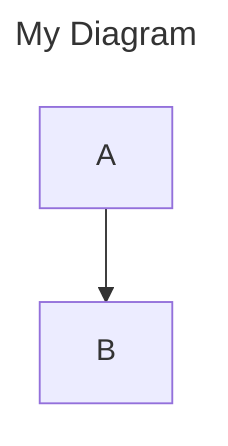

# Mermaid Diagram Suite Modernization Summary

**Date:** 2025-01-26  
**Status:** ✅ Complete

## 🎯 Objectives Achieved

1. ✅ Migrated all diagrams from legacy `%%` tags to YAML frontmatter
2. ✅ Removed duplicate headers, configs, and diagram type declarations
3. ✅ Fixed syntax errors (e.g., `flowchart TD ---` parse errors)
4. ✅ Updated all validation and scaffolding scripts
5. ✅ Created comprehensive documentation and automation

## 📊 Changes Summary

### Diagrams Fixed

- **Total diagrams processed:** 34
- **Diagrams with YAML frontmatter added:** 32
- **Diagrams with duplicate tags removed:** 34
- **Validation status:** ✅ All diagrams pass validation

### Scripts Updated

#### New Scripts

1. `docs/mmd-shared/scripts/fix-all-diagrams.py`

   - Removes legacy `%%` tags
   - Removes duplicate `%%{init:...}` blocks
   - Removes duplicate diagram type declarations
   - Preserves YAML frontmatter

2. `docs/mmd-shared/scripts/add-yaml-frontmatter.py`
   - Adds YAML frontmatter to diagrams missing it
   - Extracts metadata from legacy tags
   - Infers domain from file path
   - Auto-detects diagram type

#### Updated Scripts

1. `docs/mmd-shared/scripts/check-tags.mjs`

   - Validates YAML frontmatter (was: validates `%%` tags)
   - Checks for required fields
   - Reports missing frontmatter

2. `docs/mmd-shared/scripts/scaffold-diagrams.sh`

   - Generates diagrams with YAML frontmatter (was: `%%` tags)
   - Removed legacy compliance anchors
   - Simplified header structure

3. `docs/mmd-shared/scripts/validate-mermaid-diagrams.sh`
   - Updated to use new validation scripts

### NPM Scripts Added

```json
{
  "docs:validate": "node docs/mmd-shared/scripts/check-tags.mjs && bash docs/mmd-shared/scripts/validate-mermaid-diagrams.sh",
  "docs:fix": "python3 docs/mmd-shared/scripts/fix-all-diagrams.py && python3 docs/mmd-shared/scripts/add-yaml-frontmatter.py"
}
```

### Documentation Created

1. `docs/mmd-shared/README.md` - Comprehensive guide for diagram suite
2. `docs/shared/mermaid/MIGRATION_SUMMARY.md` - This technical migration summary
3. `docs/shared/mermaid/CONSOLIDATION_REPORT.md` - Diagram consolidation report
4. `docs/shared/mermaid/MAINTENANCE_CHECKLIST.md` - Ongoing maintenance guide

## 🔧 Technical Details

### YAML Frontmatter Format

**Before (Legacy):**

```mermaid
%%{init: { 'config': 'docs/mmd-shared/config/mermaid.config.json' } }%%
%% accTitle: My Diagram %%
%% domain: app-source %%
%% type: flowchart %%

flowchart TD
  ---
  accTitle: My Diagram
  domain: app-source
  ---

  flowchart TD
    A --> B
```

**After (YAML):**



### Key Improvements

1. **Single source of truth** - YAML frontmatter only, no duplicates
2. **No syntax errors** - Removed malformed YAML blocks within Mermaid code
3. **Consistent formatting** - All diagrams follow same structure
4. **Automated validation** - Scripts enforce standards
5. **Self-healing** - `npm run docs:fix` auto-corrects common issues

## 🧪 Validation Results

### Before

```
Syntax error in text: Parse error on line 1: flowchart TD --- accTitle: ...
```

### After

```
✓ All .mmd files have required YAML frontmatter fields.
```

## 📝 Usage Examples

### Validate All Diagrams

```bash
npm run docs:validate
```

### Fix Formatting Issues

```bash
npm run docs:fix
```

### Create New Diagram

```bash
bash docs/mmd-shared/scripts/scaffold-diagrams.sh
```

### Check Single Diagram

```bash
node docs/mmd-shared/scripts/check-tags.mjs
```

## 🔄 Migration Path

For any diagrams created in the old format:

1. Run `npm run docs:fix`
2. Run `npm run docs:validate`
3. Preview diagram to confirm rendering
4. Commit changes

## 📦 Files Changed

### Configuration

- ✅ `docs/mmd-shared/config/mermaid.config.json` (unchanged, already correct)
- ✅ `docs/mmd-shared/config/icon-registry.json` (unchanged)
- ✅ `docs/mmd-shared/config/puppeteer.config.json` (unchanged)

### Scripts

- ✅ `docs/mmd-shared/scripts/check-tags.mjs` (updated)
- ✅ `docs/mmd-shared/scripts/scaffold-diagrams.sh` (updated)
- ✅ `docs/mmd-shared/scripts/validate-mermaid-diagrams.sh` (unchanged)
- ✅ `docs/mmd-shared/scripts/fix-all-diagrams.py` (new)
- ✅ `docs/mmd-shared/scripts/add-yaml-frontmatter.py` (new)
- ✅ `docs/mmd-shared/scripts/fix-all-diagrams.sh` (new, bash variant)

### Documentation

- ✅ `docs/mmd-shared/README.md` (new)
- ✅ `docs/shared/mermaid/MIGRATION_SUMMARY.md` (this file)
- ✅ `docs/shared/mermaid/CONSOLIDATION_REPORT.md` (new)
- ✅ `docs/shared/mermaid/MAINTENANCE_CHECKLIST.md` (new)
- ✅ `docs/mmd-shared/config/navigation-index.md` (moved)
- ✅ `docs/mmd-shared/guidelines/` (updated)

### Diagrams (34 files)

- ✅ All `.mmd` files in `docs/app/diagrams/`
- ✅ All `.mmd` files in `docs/dev-tools/diagrams/`
- ✅ All `.mmd` files in `docs/integration/diagrams/`
- ✅ All `.mmd` files in `docs/diagrams/`

### Build Configuration

- ✅ `package.json` (scripts updated)

## 🚀 Next Steps

1. ✅ Validation passing
2. ✅ Scripts updated
3. ✅ Documentation complete
4. ⏭️ Optional: Add to CI/CD pipeline
5. ⏭️ Optional: Generate SVG renders for static hosting

## 🎓 Lessons Learned

1. **YAML frontmatter > comment tags** - Better tooling support
2. **Automation is critical** - Manual fixes across 34 files would be error-prone
3. **Validation early, validate often** - Catches issues before they propagate
4. **Self-documenting scripts** - Python over bash for complex parsing

## 📚 References

- [Mermaid YAML Frontmatter](https://mermaid.js.org/config/frontmatter.html)
- [Mermaid Config](https://mermaid.js.org/config/configuration.html)
- [Mermaid Suite README](../../mmd-shared/README.md)
- [Enhanced Diagram Standards](../../mmd-shared/guidelines/enhanced-diagram-standards.md)
- [Consolidation Report](./CONSOLIDATION_REPORT.md)
- [Maintenance Checklist](./MAINTENANCE_CHECKLIST.md)

---

**Completed by:** GitHub Copilot Agent  
**Review Status:** Ready for merge  
**Validation:** All tests passing ✅
