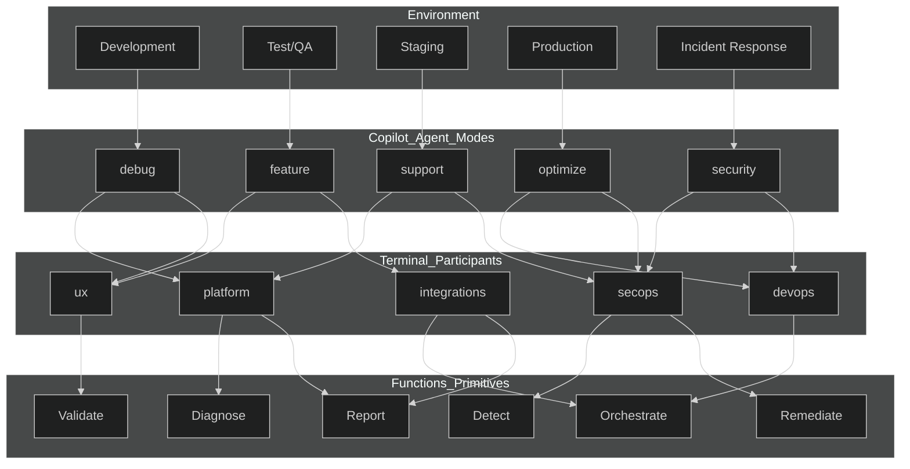
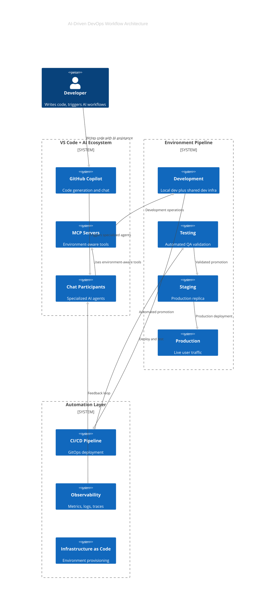
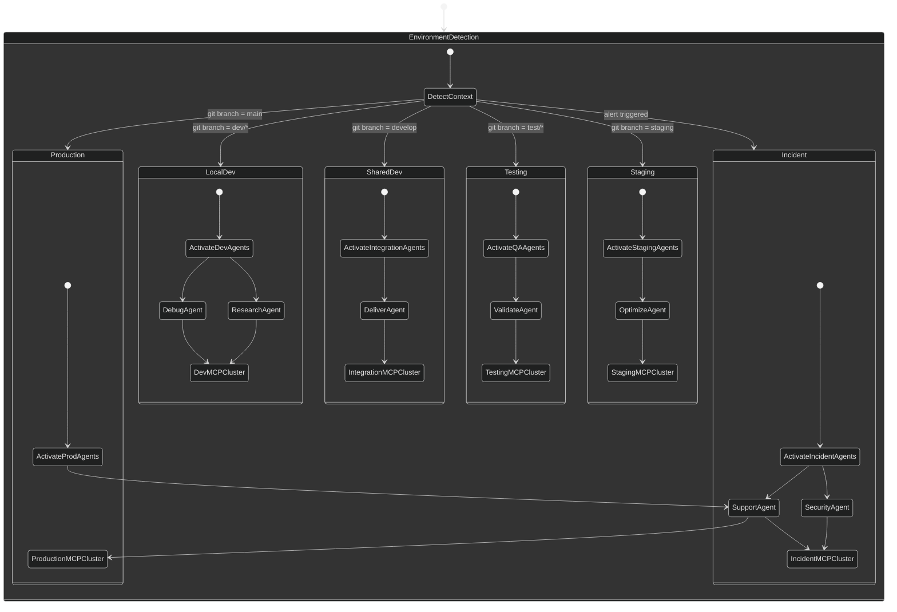
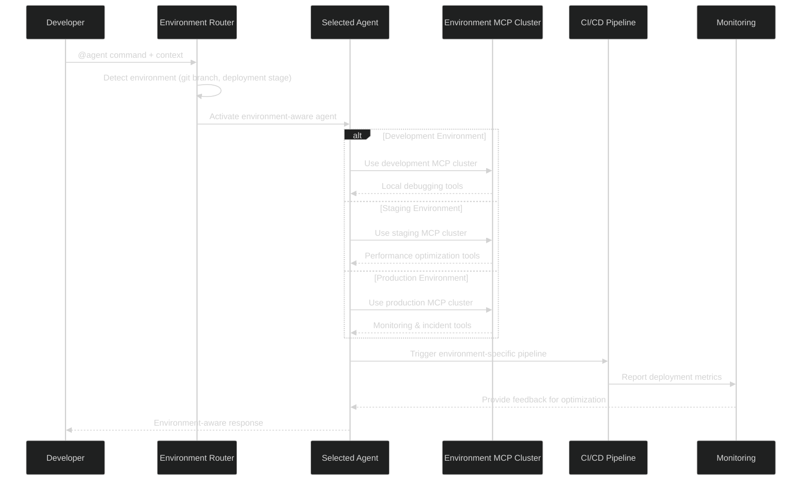

# DevOps Environment Taxonomy Research Notes (Round 2 Prep)

Source material captured for follow-up synthesis and alignment work. Content reflects modern DevOps environment boundaries, AI agent routing, and environment-aware MCP clustering proposals. Reference URLs retained for rapid validation.

---

## Diagram Source of Truth & Revision Catalog

- Treat this document as the canonical specification for environment-aware routing across Option A participants, MCP clusters, and automation hooks.
- When updating flows, edit this markdown first, then regenerate dependent diagrams via `npm run docs:patch:diagrams --source docs/tooling/end-state` followed by `npm run docs:prepare`.
- Generated Mermaid diagrams (all in `docs/tooling/end-state/`) are derived from the narratives and tables below:
  - `agent-mode-flow.mmd` – environment → agent mode → Option A participant mapping
  - `agent-environment-map-state.mmd` – environment detection → MCP cluster selection → participant activation
  - `environment-mcp-cluster.mmd` – cluster inventory aligned with Option A tooling
  - `agent-coordination-flow.mmd` and `workflow-architecture-c4.mmd` – promotion pipeline feedback loops
    - Repository-wide ER view (`docs/tooling/end-state/dev-tool-suite-ER.mmd`) is the source-of-truth for participant/automation relationships
- Document revisions that impact diagrams must be noted in `docs/tooling/end-state/tools-suite-migration-plan.md` (Phase 2/3 checkpoints) to keep the migration ledger synchronized.

---

## Modern DevOps Environment Boundaries

### Development Environment Taxonomy

| Environment     | Purpose                                   | Boundaries                                    | Access Control  |
| :-------------- | :---------------------------------------- | :-------------------------------------------- | :-------------- |
| **Sandbox**     | Individual dev experimentation            | Local/isolated, no shared state               | Developer-owned |
| **Development** | Integration testing, shared dev state     | Shared infrastructure, relaxed security       | Team access     |
| **Testing/QA**  | Automated testing, performance validation | Production-like data, controlled access       | QA + Dev teams  |
| **Staging**     | Production replica for final validation   | Identical to prod infrastructure              | Limited access  |
| **Production**  | Live user traffic                         | Strict security, monitoring, SLA requirements | Ops team only   |

### Key Functional Differences

- **Data Separation**: Development uses synthetic/anonymized data; Production uses real user data.
- **Security Posture**: Dev environments have relaxed controls; Production has strict access controls and compliance.
- **Monitoring Depth**: Development focuses on debugging; Production emphasizes observability and alerting.
- **Change Velocity**: Development allows rapid iteration; Production requires change management processes.
- **Resource Scaling**: Development uses minimal resources; Production auto-scales based on demand.

---

## Optimized AI Agent DevOps Taxonomy

### Environment-Aware Agent Modes

### Layer-Aligned Participant Mapping (Option A)

Source of record: `docs/tooling/staging/chat-participants-taxonomy.md` (promote to `docs/tooling/end-state/` after approval).

| Participant Tag            | Layers Covered                                                 | Key Activities                                                                    | Agent Pairings                    | MCP / Automation Hooks                                                           |
| -------------------------- | -------------------------------------------------------------- | --------------------------------------------------------------------------------- | --------------------------------- | -------------------------------------------------------------------------------- |
| `@ux`                      | Frontend experience & design                                   | React UI audits, accessibility, component hygiene, DevTools telemetry             | `@deliver`, `@debug`              | `react-devtools`, design checklist                                               |
| `@platform`                | API services, database, integrations, enrichment quality       | Endpoint diagnostics, schema/migration review, enrichment data QA, reporting KPIs | `@debug`, `@deliver`, `@support`  | `supabase-dev`, `integration-hub`, Postgres validators, `ci_cd_validation_suite` |
| `@devops`                  | CI/CD, infrastructure, container orchestration                 | Pipeline tuning, Docker/IaC updates, environment routing, diagram guardrails      | `@deliver`, `@optimize`           | `docs:patch:diagrams`, Docker tasks, GitHub workflow guard                       |
| `@secops`                  | Security posture, compliance, observability, incident response | Risk triage, alert tuning, production telemetry, rollback playbooks               | `@support`, `@debug`, `@optimize` | `security-scan`, observability MCP, `context-snapshot.sh`, rollback scripts      |
| `@integrations` (optional) | External partner APIs, payments, webhook orchestration         | Contract validation, vendor health checks, future Stripe workflows                | `@deliver`, `@research`           | Integration MCP cluster, Stripe hooks (planned), CRM connectors                  |

### Intelligent DevOps Workflow Architecture

### Enhanced Agent-to-Environment Mapping

---

## Optimized MCP Server Architecture

```mermaid
%%{init: {'theme': 'dark'}}%%
flowchart TD
    subgraph env_clusters ["Environment-Specific MCP Clusters"]
        subgraph dev_cluster ["Development Cluster"]
            D1[chrome-devtools-local]
            D2[github-dev-ops]
            D3[supabase-dev]
            D4[postgres-local]
        end
        subgraph test_cluster ["Testing Cluster"]
            T1[integration-testing]
            T2[performance-profiling]
            T3[quality-gates]
            T4[test-data-management]
        end
        subgraph stage_cluster ["Staging Cluster"]
            S1[supabase-staging]
            S2[observability-staging]
            S3[deployment-validation]
            S4[cost-optimization]
        end
        subgraph prod_cluster ["Production Cluster"]
            P1[supabase-production]
            P2[monitoring-alerts]
            P3[incident-response]
            P4[security-scanning]
        end
    end
    subgraph cross_tools ["Cross-Environment Tools"]
        X1[github-cicd]
        X2[infrastructure-as-code]
        X3[secrets-management]
    end
    ENV_ROUTER[Environment Router]
    ENV_ROUTER --> D1
    ENV_ROUTER --> T1
    ENV_ROUTER --> S1
    ENV_ROUTER --> P1
    ENV_ROUTER --> X1
```

### Enhanced Agent Coordination Flow

---

## Key Improvement Themes

1. **Environment-Aware Routing**: Agents automatically select environment-specific tools based on branch/stage.
2. **Security Boundaries**: Production MCP servers separated from development endpoints; access tightly controlled.
3. **GitOps Integration**: Environment-specific Git branches with automated promotion gates.
4. **Observability Feedback Loop**: Monitoring signals inform agent decisions and close the loop after deployments.
5. **Incident Response Mode**: Dedicated pathways for security/support agents during alerts.

---

## Reference Index

1. https://www.statsig.com/perspectives/dev-vs-staging-vs-prod
2. https://docs.aws.amazon.com/prescriptive-guidance/latest/choosing-git-branch-approach/understanding-the-devops-environments.html
3. https://octopus.com/devops/gitops/gitops-environments/
4. https://www.datadoghq.com/blog/gitops-principles-and-components/
5. https://octopus.com/devops/devops-approach/
6. https://www.linkedin.com/pulse/why-one-environment-never-enough-modern-devops-alexandr-zaichenko-07qbe
7. https://www.reddit.com/r/azuredevops/comments/1fp41os/help_me_to_understand_environments_please/
8. https://www.firefly.ai/academy/what-is-infrastructure-as-code
9. https://azure.microsoft.com/en-us/resources/cloud-computing-dictionary/what-is-devops
10. https://arxiv.org/html/2507.05100v1
11. https://dodcio.defense.gov/Portals/0/Documents/Library/DoD%20Enterprise%20DevSecOps%20Fundamentals%20v2.5.pdf
12. https://codefresh.io/blog/stop-using-branches-deploying-different-gitops-environments/
13. https://www.chkk.io/blog/iac-repo-patterns-in-the-wild
14. https://hhhypergrowth.com/what-is-the-modern-devops-workflow/
15. https://www.redhat.com/en/blog/gitops-approval-application-deployment-environment
16. https://www.sciencedirect.com/science/article/pii/S0164121223003035
17. https://www.qovery.com/blog/devops-automation
18. https://www.reddit.com/r/devops/comments/msrlhe/how_do_you_manage_multiple_environments_with/
19. https://www.chrisparnin.me/pdf/GangOfEight.pdf
20. https://www.reddit.com/r/devops/comments/1fm542y/cicd_strategies_with_environment_specific/
