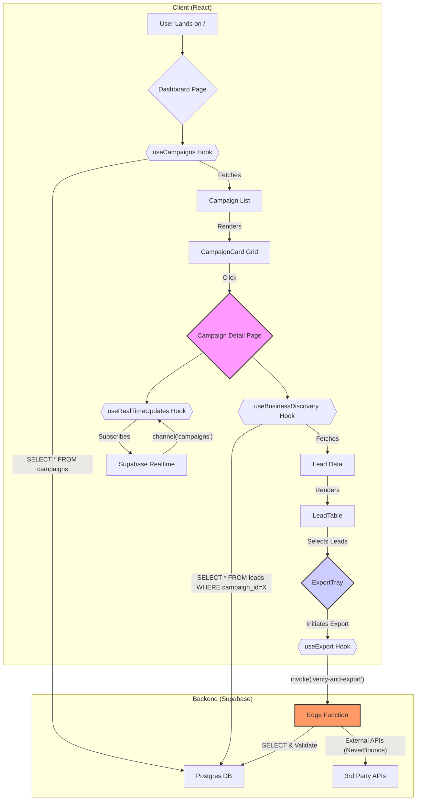

# 🏗️ ProspectPro Frontend Architecture v2.1

## 🎯 **System Overview**

### **Architecture Pattern: Modern React Migration from Legacy HTML**

- **Current Production**: HTML/Vanilla JS frontend (`public/` directory)
- **Target Frontend**: React 18 + TypeScript + Vite (Lovable deployment)
- **Backend**: Node.js/Express + Supabase (Production Ready - v2.0)
- **Migration Strategy**: Gradual component replacement with feature parity
- **Real-Time**: Supabase Realtime subscriptions (already implemented)
- **State**: Zustand with persistence + React Query for server state
- **Deployment**: Lovable (React) → Node.js backend (Railway/Supabase)

### **Production Backend Integration**

The current production backend (main branch) provides these endpoints:

- `GET /health` - System health check
- `POST /api/business-discovery` - Enhanced business discovery with 4-stage pipeline
- `GET /api/campaigns/:id/export` - CSV/JSON export functionality
- `GET /api/dashboard/metrics` - Campaign analytics and cost tracking
- Real-time WebSocket connections via Supabase channels

**Database Schema**: Complete with enhanced_leads, campaigns, api_costs tables and RLS policies.

---

## 📊 **Data Flow Architecture**



### **Real-Time Data Pipeline**

#### **1. Campaign Initiation**

```typescript
User Input → Business Discovery Form → Edge Function Call → Database Insert → Real-time Subscription
```

#### **2. Lead Processing**

```typescript
Edge Function → 4-Stage Pipeline → Batch Lead Insert → Real-time Updates → Frontend State Update
```

#### **3. Cost Tracking**

```typescript
API Call → Cost Calculation → Database Update → Real-time Cost Display → Budget Alerts
```

---

## 🧩 **Component Architecture (Tiered Implementation)**

This architecture is designed for progressive enhancement, aligning with the Tier 1, 2, and 3 recommendations.

#### **Tier 1: Core UX & Layout**

- **`AppLayout.tsx`**: The persistent shell for the entire application. It contains the main navigation (`Sidebar.tsx`) and a dynamic header. This ensures a consistent user experience and immediate access to core functions.
- **`pages/index.tsx` (Central Dashboard)**: The new application entry point. It displays a grid of `CampaignCard` components, providing an immediate, high-level overview of all user activities. Replaces the previous, more fragmented landing page.
- **`CampaignCard.tsx`**: A modular, at-a-glance summary of a single campaign. Displays key stats (e.g., leads found, cost, status) and serves as a navigation point to the detailed campaign view.
- **`LoadingSkeleton.tsx` & `EmptyState.tsx`**: Critical for a polished user experience. Skeletons provide a perceived performance boost during data fetching, while empty states guide the user when no data is available, preventing blank screens.

#### **Tier 2: Enhanced Functionality & Feedback**

- **`BusinessDiscoveryForm.tsx` (Enhanced)**: Upgraded to include a real-time cost and time estimator. This component provides immediate feedback to the user about the potential impact of their search query _before_ they commit to it, aligning with our cost-control principles.
- **`ConfidenceBar.tsx`**: A visual component used within the `LeadTable` to represent the quality score of a lead. It translates a numerical score (0-100) into an intuitive, color-coded bar, allowing for rapid visual scanning of lead quality.
- **`ExportTray.tsx`**: A non-modal, slide-out panel for managing the export process. It replaces the previous disruptive modal, allowing users to configure and monitor exports while still interacting with the main application. This is a significant UX improvement for asynchronous tasks.

#### **Tier 3: Advanced & "Lovable" Features**

- **`BudgetTracker.tsx`**: A visual gauge that provides a persistent, real-time view of the campaign's budget consumption against its limit. This component makes budget awareness a constant, ambient part of the user interface.
- **`CampaignList.tsx`**: A small, scrollable list of recent campaigns, typically placed in the `AppLayout`'s sidebar. It provides quick navigation between active or recent campaigns, improving workflow for power users.
- **Interactive Onboarding/Help System**: A guided tour or context-sensitive help system (e.g., using a library like Shepherd.js) to introduce users to the cost-saving features and advanced functionality, improving feature discovery and user confidence.

---

## 🔄 **State Management Strategy**

### **State Architecture: Hybrid Cost-Aware Approach**

#### **Client State (Zustand) - Enhanced for Cost Management**

```typescript
// Campaign state - transient, session-based with cost awareness
interface CampaignStore {
  activeCampaign: Campaign | null;
  discoveryProgress: DiscoveryProgress;
  selectedLeads: string[];
  filters: LeadFilters;
  exportConfig: ExportConfig;

  // Cost-aware state
  isActiveCampaign: boolean;
  budgetRemaining: number;
  projectedCost: number;
  isIdle: boolean; // For disabling realtime when complete
}

// User preferences - persistent
interface UserStore {
  budgetPreferences: BudgetPreferences;
  exportSettings: ExportSettings;
  dashboardLayout: DashboardConfig;
  costOptimizationMode: "standard" | "economy" | "premium";
}
```

#### **Server State (React Query) - Optimized for Performance**

```typescript
// API data - cached with cost-aware invalidation
const queryClient = new QueryClient({
  defaultOptions: {
    queries: {
      staleTime: 5 * 60 * 1000, // 5 minutes
      cacheTime: 10 * 60 * 1000, // 10 minutes
      refetchOnWindowFocus: false,
      refetchInterval: false, // Disabled by default, enabled only during active campaigns
    },
  },
});

// Key queries with projection:
// - ['campaigns'] - Campaign list (summary fields only)
// - ['leads', campaignId, page] - Paginated campaign leads
// - ['lead-details', leadId] - Full lead details (on demand)
// - ['costs', campaignId] - Real-time cost tracking
// - ['system-health'] - System status
```

#### **Real-Time State (Batched Realtime Reducer)**

```typescript
// Cost-aware realtime with batched updates and idle mode
const useRealTimeUpdates = (campaignId: string, isIdle = false) => {
  const queue = useRef<any[]>([]);
  const rafRef = useRef<number>(0);

  const flushBatch = useCallback(() => {
    if (queue.current.length > 0) {
      queryClient.setQueryData(['leads', campaignId, 0], (old: any[] = []) =>
        [...old, ...queue.current]
      );
      queue.current = [];
    }
    rafRef.current = 0;
  }, [campaignId]);

  useEffect(() => {
    // Skip subscription if campaign is idle/completed
    if (isIdle) return;

    const subscription = supabase
      .channel(`campaign-${campaignId}`)
      .on('postgres_changes', {
        event: '*', schema: 'public',
        table: 'enhanced_leads',
        filter: `campaign_id=eq.${campaignId}`
      }, (payload) => {
        // Batch updates for performance
        queue.current.push(payload.new);
        if (!rafRef.current) {
          rafRef.current = requestAnimationFrame(flushBatch);
        }
      })
      .subscribe();

    return () => {
      if (rafRef.current) cancelAnimationFrame(rafRef.current);
      supabase.removeChannel(subscription);
    };
  }, [campaignId, isIdle, flushBatch]);
};

    return () => supabase.removeChannel(subscription);
  }, [campaignId]);
};
```

---

## 🎨 **UI/UX Design System**

### **Design Principles (Enhanced)**

1. **Progressive Disclosure** - Show complexity only when needed
2. **Real-Time Feedback** - Immediate visual response to actions
3. **Confidence Visualization** - Clear quality indicators with color coding
4. **Cost Transparency** - Always visible budget tracking with projections
5. **Accessibility First** - WCAG AA compliance, keyboard navigation, dark mode
6. **Performance Feedback** - Loading skeletons, optimistic updates, error recovery

### **Enhanced UI Patterns**

#### **Confidence Visualization System**

```typescript
// Color-coded confidence chips with consistent design
const getConfidenceStyles = (score: number) => ({
  className:
    score >= 80
      ? "bg-green-50 text-green-700 ring-green-200"
      : score >= 60
      ? "bg-amber-50 text-amber-700 ring-amber-200"
      : "bg-rose-50 text-rose-700 ring-rose-200",
  label:
    score >= 80
      ? "High Quality"
      : score >= 60
      ? "Good Quality"
      : "Needs Review",
  icon: score >= 80 ? "✅" : score >= 60 ? "⚠️" : "❌",
});
```

#### **Budget Gauge Component**

```typescript
interface BudgetGaugeProps {
  used: number;
  limit: number;
  projected?: number;
}

// Example: "$12.40 of $25 used • 50% under budget • est. $0.42/qualified lead"
const BudgetGauge = ({ used, limit, projected }: BudgetGaugeProps) => {
  const percentage = (used / limit) * 100;
  const remaining = limit - used;
  const isNearLimit = percentage > 80;

  return (
    <div className="space-y-2">
      <div className="flex justify-between text-sm">
        <span>
          ${used.toFixed(2)} of ${limit} used
        </span>
        <span className={isNearLimit ? "text-red-600" : "text-green-600"}>
          {percentage.toFixed(0)}% {isNearLimit ? "near limit" : "under budget"}
        </span>
      </div>
      <ProgressBar
        value={percentage}
        className={isNearLimit ? "bg-red-500" : "bg-blue-500"}
      />
      {projected && (
        <p className="text-xs text-gray-600">
          Projected total: ${(used + projected).toFixed(2)}
        </p>
      )}
    </div>
  );
};
```

### **Component Design Patterns**

#### **Lead Display Pattern**

```typescript
interface LeadCardProps {
  lead: Lead;
  showDetails: boolean;
  onSelect: (leadId: string) => void;
  onExport: (leadId: string) => void;
}

// Visual hierarchy:
// 1. Business name + confidence score (prominent)
// 2. Contact info + validation status (secondary)
// 3. Source attribution + data points (tertiary)
```

#### **Progress Visualization Pattern**

```typescript
interface ProgressIndicatorProps {
  stage: DiscoveryStage;
  progress: number;
  totalCost: number;
  budgetLimit: number;
  remainingBudget: number;
}

// Visual states:
// - Active: Blue progress bar with animation
// - Completed: Green checkmark with summary
// - Warning: Yellow alert when near budget
// - Error: Red indicator with retry option
```

#### **Cost Display Pattern**

```typescript
interface CostTrackerProps {
  currentCost: number;
  budgetLimit: number;
  costBreakdown: ApiCostBreakdown;
  projectedTotal: number;
}

// Visual elements:
// - Primary: Large cost display with budget bar
// - Secondary: API breakdown chart
// - Tertiary: Cost per lead calculation
```

---

## 🔌 **API Integration Architecture**

### **Edge Function Integration**

```typescript
// Centralized API client
class ProspectProAPI {
  private supabase = createClient(env.SUPABASE_URL, env.SUPABASE_ANON_KEY);

  async startDiscovery(params: DiscoveryParams): Promise<Campaign> {
    const { data, error } = await this.supabase.functions.invoke(
      "enhanced-business-discovery",
      { body: params }
    );
    if (error) throw new APIError(error.message);
    return data;
  }

  async getLeads(campaignId: string): Promise<Lead[]> {
    const { data, error } = await this.supabase
      .from("enhanced_leads")
      .select("*")
      .eq("campaign_id", campaignId)
      .order("confidence_score", { ascending: false });

    if (error) throw new APIError(error.message);
    return data;
  }

  async exportLeads(campaignId: string, format: ExportFormat): Promise<string> {
    const { data, error } = await this.supabase.functions.invoke(
      "export-campaign",
      { body: { campaignId, format } }
    );
    if (error) throw new APIError(error.message);
    return data.downloadUrl;
  }
}
```

### **Error Handling Strategy**

```typescript
// Centralized error handling
class APIError extends Error {
  constructor(
    message: string,
    public code: string,
    public recoverable: boolean = false
  ) {
    super(message);
  }
}

// Hook for error handling
const useAPIError = () => {
  const showError = (error: APIError) => {
    if (error.code === "BUDGET_EXCEEDED") {
      // Show budget exceeded modal with options
      showBudgetExceededModal();
    } else if (error.code === "QUOTA_EXCEEDED") {
      // Show API quota exceeded message
      showQuotaExceededMessage();
    } else if (error.recoverable) {
      // Show retry option
      showRetryableError(error);
    } else {
      // Show general error message
      showGeneralError(error);
    }
  };

  return { showError };
};
```

---

## � **Cost Optimization Patterns**

### **Verify-on-Export Strategy**

```typescript
// Only verify leads when user exports (30-45% cost savings)
const useExportWithVerification = () => {
  const [isVerifying, setIsVerifying] = useState(false);

  const exportWithVerification = async (
    selectedLeads: string[],
    campaignId: string
  ) => {
    // Get cost estimate first
    const estimate = await api.estimateVerificationCost(selectedLeads);

    if (estimate.projectedCost > 0) {
      const confirmed = confirm(
        `Email verification will cost ~$${estimate.projectedCost.toFixed(
          2
        )}. Continue?`
      );
      if (!confirmed) return;
    }

    setIsVerifying(true);
    try {
      return await api.exportCampaign({
        campaignId,
        format: "csv",
        verifyOnExport: true,
        selectedLeadIds: selectedLeads,
      });
    } finally {
      setIsVerifying(false);
    }
  };

  return { exportWithVerification, isVerifying };
};
```

### **Budget Guardrails**

```typescript
// Project cost and abort before budget exceeded
const useBudgetGuard = (budgetLimit: number) => {
  const [projectedCost, setProjectedCost] = useState(0);

  const checkBudgetBeforeAction = (estimatedCost: number) => {
    const total = projectedCost + estimatedCost;

    if (total > budgetLimit * 0.9) {
      throw new APIError(
        `Projected cost ($${total.toFixed(2)}) exceeds 90% of budget`,
        "BUDGET_EXCEEDED"
      );
    }

    return true;
  };

  return { projectedCost, setProjectedCost, checkBudgetBeforeAction };
};
```

### **Column Projection & Pagination**

```typescript
// Fetch only needed columns and paginate for efficiency
const useEfficientLeadList = (campaignId: string) => {
  const [page, setPage] = useState(0);
  const pageSize = 50;

  return useQuery(
    ["leads", campaignId, page],
    () =>
      supabase
        .from("enhanced_leads")
        .select("id,business_name,confidence_score,is_qualified,phone,email")
        .eq("campaign_id", campaignId)
        .order("confidence_score", { ascending: false })
        .range(page * pageSize, (page + 1) * pageSize - 1),
    {
      keepPreviousData: true,
      staleTime: 2 * 60 * 1000, // 2 minutes for list data
    }
  );
};
```

---

## �📈 **Performance Optimization**

### **Frontend Performance Strategy**

#### **Code Splitting & Lazy Loading**

```typescript
// Route-based code splitting
const Dashboard = lazy(() => import("./pages/Dashboard"));
const BusinessDiscovery = lazy(() => import("./pages/BusinessDiscovery"));
const Results = lazy(() => import("./pages/Results"));

// Component-based splitting for heavy features
const ExportModal = lazy(() => import("./components/ExportModal"));
const AdvancedFilters = lazy(() => import("./components/AdvancedFilters"));
```

#### **React Query Optimizations**

```typescript
// Prefetch strategy
const usePrefetchCampaigns = () => {
  const queryClient = useQueryClient();

  useEffect(() => {
    // Prefetch likely next page
    queryClient.prefetchQuery(["campaigns"], fetchCampaigns);
  }, []);
};

// Background updates
const useBackgroundSync = (campaignId: string) => {
  return useQuery(["leads", campaignId], fetchLeads, {
    refetchInterval: 10000, // 10 seconds during active campaigns
    refetchIntervalInBackground: true,
  });
};
```

#### **Memory Management**

```typescript
// Cleanup strategy for large datasets
const useLeadPagination = (campaignId: string) => {
  const [page, setPage] = useState(0);
  const pageSize = 50;

  const { data: leads } = useQuery(
    ["leads", campaignId, page],
    () => fetchLeads(campaignId, page, pageSize),
    {
      keepPreviousData: true, // Smooth pagination
      cacheTime: 5 * 60 * 1000, // 5 minutes
    }
  );

  // Cleanup old pages when memory usage is high
  useEffect(() => {
    const cleanupOldPages = () => {
      const queryCache = queryClient.getQueryCache();
      const queries = queryCache.findAll(["leads", campaignId]);

      if (queries.length > 10) {
        // Keep only 10 pages in cache
        queries.slice(0, -10).forEach((query) => {
          queryClient.removeQueries(query.queryKey);
        });
      }
    };

    const interval = setInterval(cleanupOldPages, 30000);
    return () => clearInterval(interval);
  }, [campaignId]);
};
```

---

## 🔒 **Security Architecture**

### **Frontend Security Measures**

#### **API Key Management**

```typescript
// Environment variable validation
const validateEnvVars = () => {
  const required = ["VITE_SUPABASE_URL", "VITE_SUPABASE_ANON_KEY"];

  const missing = required.filter((key) => !import.meta.env[key]);
  if (missing.length > 0) {
    throw new Error(`Missing environment variables: ${missing.join(", ")}`);
  }
};

// API key rotation handling
const useAPIKeyRotation = () => {
  useEffect(() => {
    const checkKeyValidity = async () => {
      try {
        await supabase.auth.getSession();
      } catch (error) {
        if (error.message.includes("Invalid JWT")) {
          // Handle key rotation
          window.location.reload();
        }
      }
    };

    const interval = setInterval(checkKeyValidity, 5 * 60 * 1000);
    return () => clearInterval(interval);
  }, []);
};
```

#### **Data Validation**

```typescript
// Input sanitization
const sanitizeSearchInput = (input: string): string => {
  return input
    .trim()
    .replace(/[<>]/g, "") // Remove potential HTML
    .substring(0, 100); // Limit length
};

// Response validation
const validateLeadData = (lead: unknown): Lead => {
  const schema = z.object({
    id: z.string(),
    business_name: z.string(),
    confidence_score: z.number().min(0).max(100),
    email: z.string().email().optional(),
    phone: z.string().optional(),
    website: z.string().url().optional(),
  });

  return schema.parse(lead);
};
```

---

## 📊 **Monitoring & Analytics**

### **Frontend Monitoring Strategy**

#### **Performance Monitoring**

```typescript
// Performance metrics collection
const usePerformanceMonitoring = () => {
  useEffect(() => {
    // Monitor Core Web Vitals
    const observer = new PerformanceObserver((list) => {
      list.getEntries().forEach((entry) => {
        if (entry.entryType === "navigation") {
          // Track page load times
          analytics.track("page_load_time", {
            path: window.location.pathname,
            loadTime: entry.duration,
          });
        }
      });
    });

    observer.observe({ entryTypes: ["navigation", "measure"] });

    return () => observer.disconnect();
  }, []);
};
```

#### **Error Tracking**

```typescript
// Error boundary with reporting
class ErrorBoundary extends Component {
  componentDidCatch(error: Error, errorInfo: ErrorInfo) {
    // Report to monitoring service
    analytics.track("frontend_error", {
      error: error.message,
      stack: error.stack,
      componentStack: errorInfo.componentStack,
      timestamp: new Date().toISOString(),
      userAgent: navigator.userAgent,
    });
  }
}
```

#### **User Analytics**

```typescript
// Campaign success tracking
const useCampaignAnalytics = () => {
  const trackCampaignStart = (params: DiscoveryParams) => {
    analytics.track("campaign_started", {
      businessType: params.businessType,
      location: params.location,
      budgetLimit: params.budgetLimit,
      timestamp: new Date().toISOString(),
    });
  };

  const trackCampaignComplete = (results: CampaignResults) => {
    analytics.track("campaign_completed", {
      totalLeads: results.totalLeads,
      qualifiedLeads: results.qualifiedLeads,
      totalCost: results.totalCost,
      costPerLead: results.costPerLead,
      duration: results.duration,
      timestamp: new Date().toISOString(),
    });
  };

  return { trackCampaignStart, trackCampaignComplete };
};
```

---

## 🚀 **Deployment Architecture**

### **Production Deployment Pipeline**

#### **Build Configuration**

```typescript
// vite.config.ts - Production optimizations
export default defineConfig({
  build: {
    target: "es2020",
    minify: "terser",
    sourcemap: false,
    rollupOptions: {
      output: {
        manualChunks: {
          vendor: ["react", "react-dom"],
          supabase: ["@supabase/supabase-js"],
          charts: ["recharts"],
        },
      },
    },
  },
  define: {
    __BUILD_TIME__: JSON.stringify(new Date().toISOString()),
    __VERSION__: JSON.stringify(process.env.npm_package_version),
  },
});
```

#### **Environment Management**

```bash
# Development
VITE_SUPABASE_URL=https://sriycekxdqnesdsgwiuc.supabase.co
VITE_SUPABASE_ANON_KEY=dev_anon_key
VITE_ENABLE_DEBUG=true

# Production
VITE_SUPABASE_URL=https://sriycekxdqnesdsgwiuc.supabase.co
VITE_SUPABASE_ANON_KEY=prod_anon_key
VITE_ENABLE_DEBUG=false
VITE_ENABLE_ANALYTICS=true
```

#### **Deployment Strategy**

```yaml
# GitHub Actions deployment
name: Deploy to Lovable
on:
  push:
    branches: [main]

jobs:
  deploy:
    runs-on: ubuntu-latest
    steps:
      - uses: actions/checkout@v3
      - uses: actions/setup-node@v3
      - run: npm install
      - run: npm run build
      - run: npm run test
      - run: lovable deploy --prod
```

---

## ✅ **Implementation Readiness Checklist**

### **Backend Integration Points**

- ✅ **Supabase Database** - Production schema deployed
- ✅ **Edge Functions** - All functions deployed and tested
- ✅ **Real-time Subscriptions** - Row Level Security configured
- ✅ **Webhook System** - Event-driven updates operational
- ✅ **Cost Tracking** - Budget management APIs ready

### **Frontend Development Ready**

- ✅ **API Compatibility** - All endpoints documented and tested
- ✅ **Real-time Data** - Subscription patterns defined
- ✅ **State Management** - Architecture and patterns defined
- ✅ **Component Library** - Design system and patterns ready
- ✅ **Performance Strategy** - Optimization patterns defined

**The architecture is production-ready for immediate Lovable implementation!** 🚀
